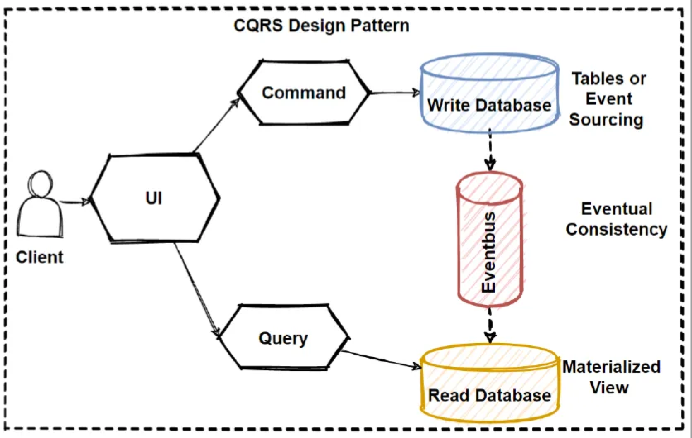

# cqrs-nestjs-example




[CQRS](https://en.wikipedia.org/wiki/Command%E2%80%93query_separation)를 지원하는 서비스 코드 예제입니다.


- Command와 Read를 분리하는 데 의의를 두고 있습니다.
- 이 Repository에서는 실제로 Write/Read 데이터베이스를 나누고 있지는 않습니다.

## Configuration

- `config/.{development|production}.env`파일을 토대로 구동 환경에 필요한 설정을 관리하고 있습니다.
- 설정에 대한 자세한 설명은 [사용자 설정](/config)을 참고하세요.

## Installation

```bash
$ npm install
```

### Local DB Installation

- 개발 및 테스트 지원을 위해서, 로컬 환경에 MongoDB를 구동시킬 수 있습니다.
- 자세한 방법은 [Local DB Installation](/docker)을 참고하세요.

## Running the app

- 개발 환경에서 Swagger를 지원하고 있습니다.
  - `http://localhost:8080/docs`에서 지원하는 API 목록을 확인할 수 있습니다.

```bash
# development mode
$ npm run start:dev # or use 'npm start'

# production mode
$ npm run start:prod
```

## Test

```bash
# unit tests
$ npm run test

# e2e tests
$ npm run test:e2e

# test coverage
$ npm run test:cov
```
